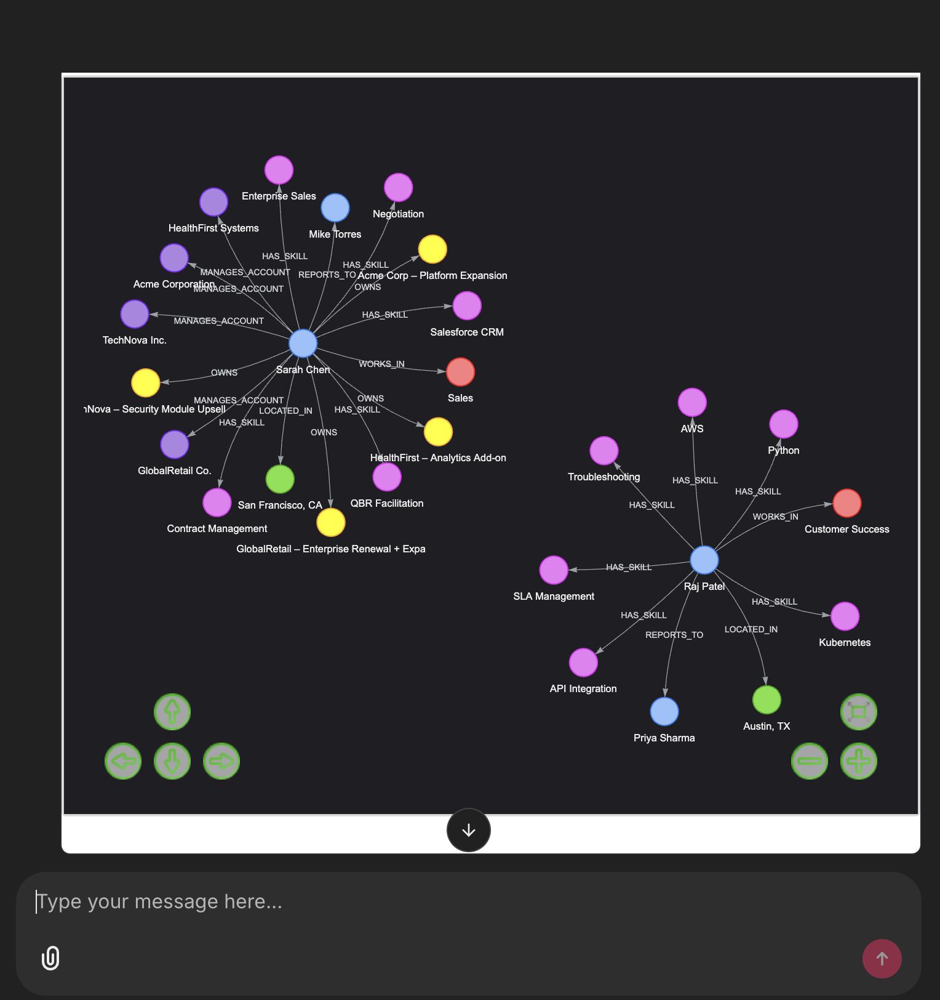
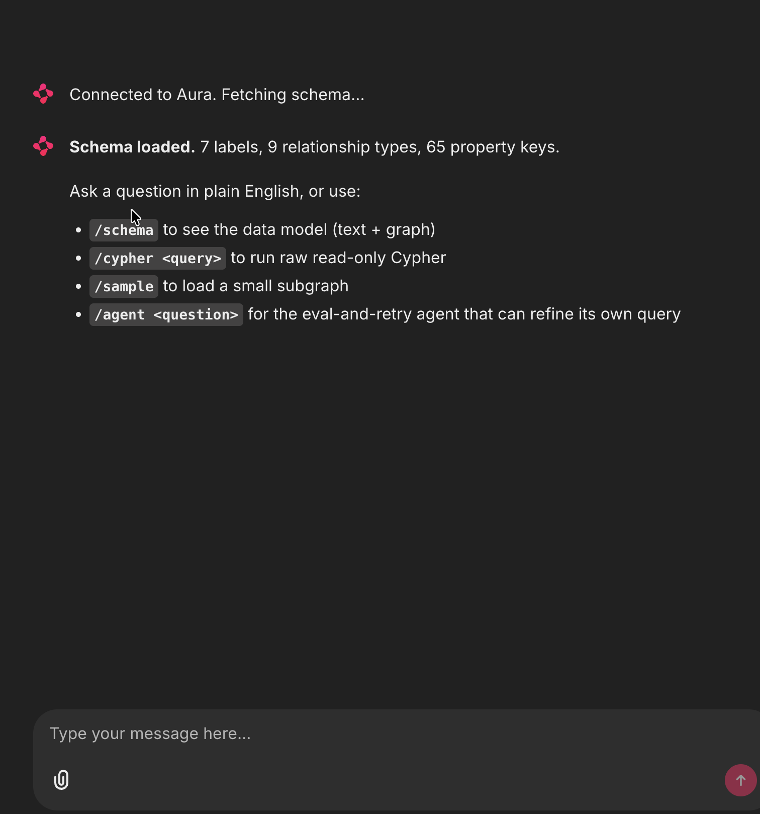
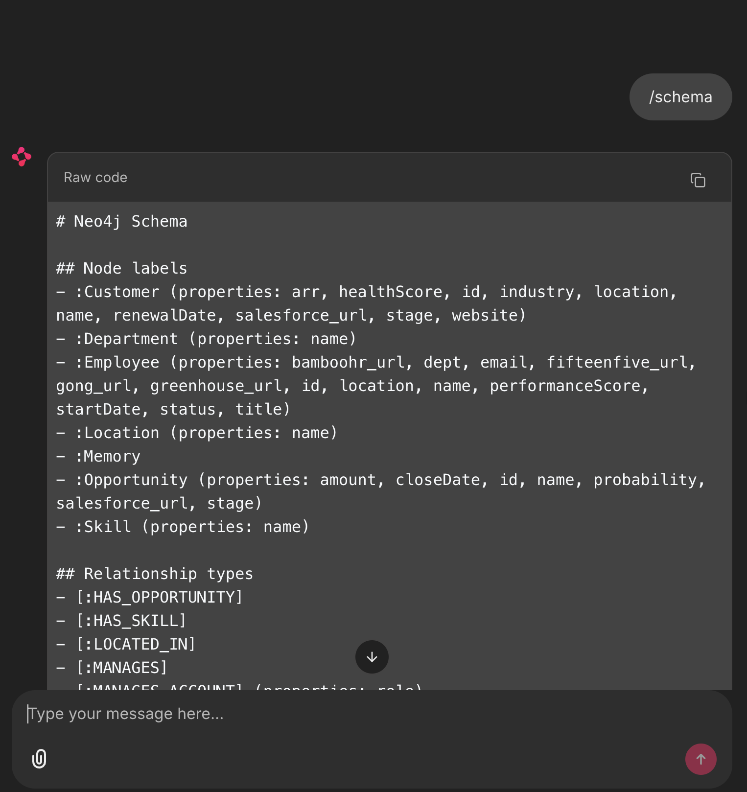
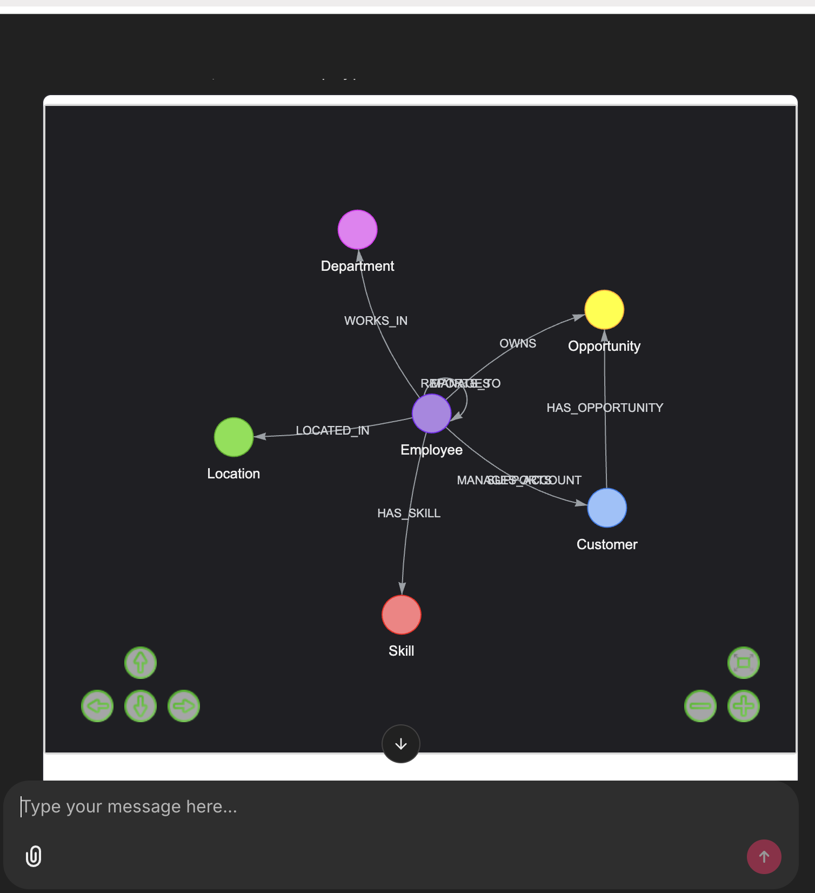
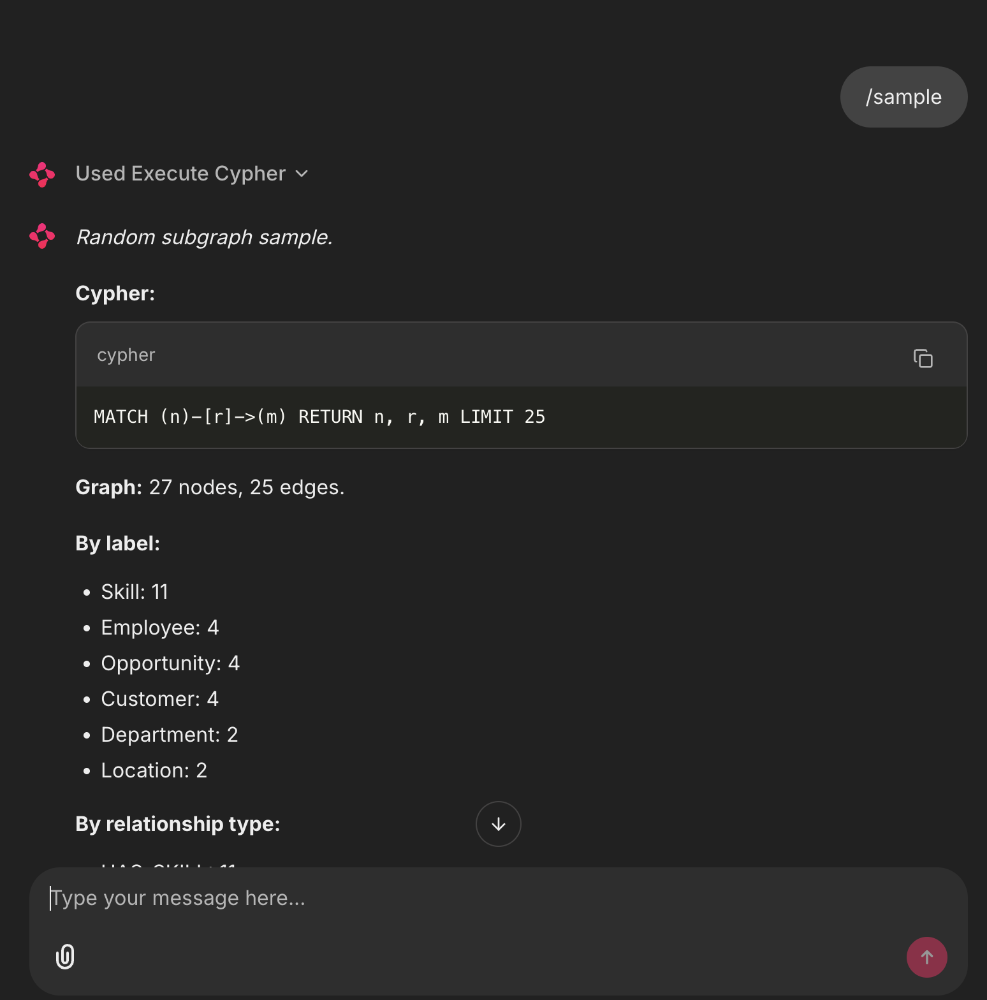
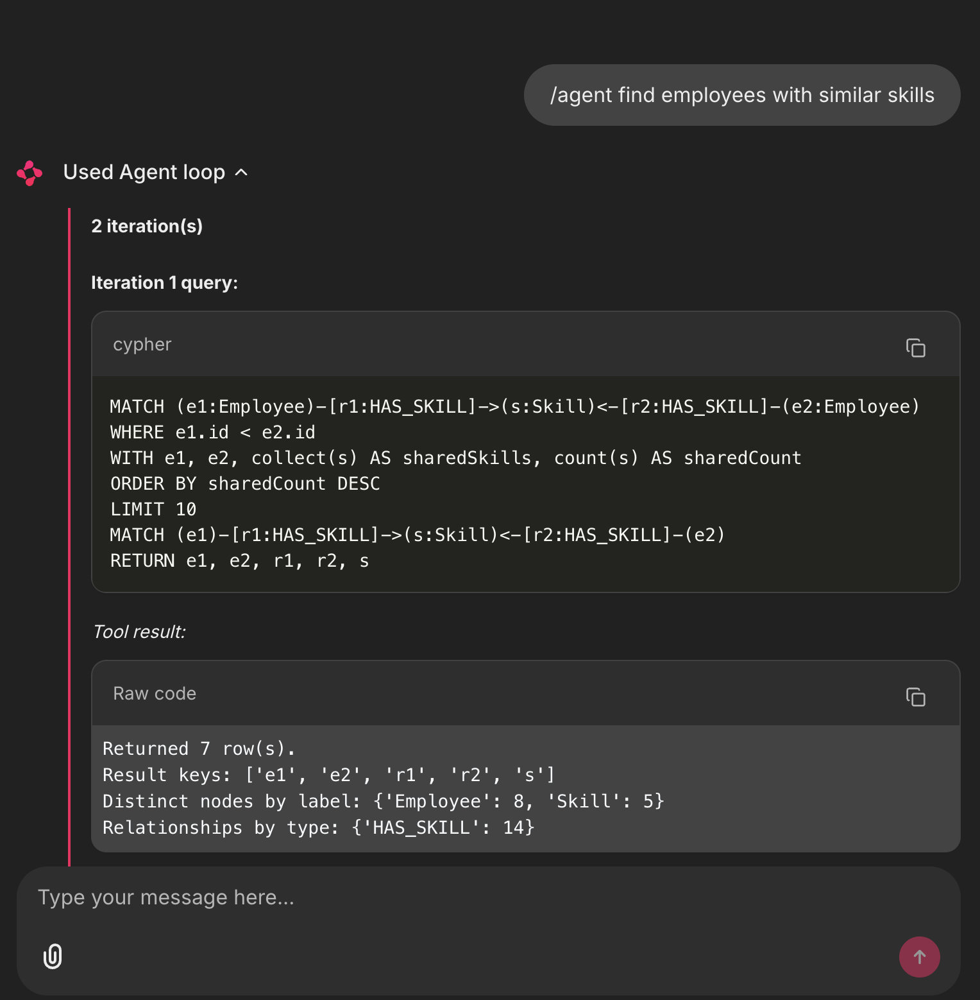
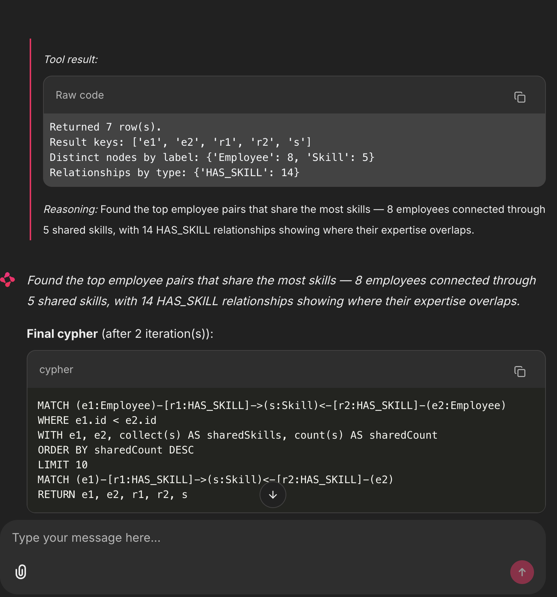
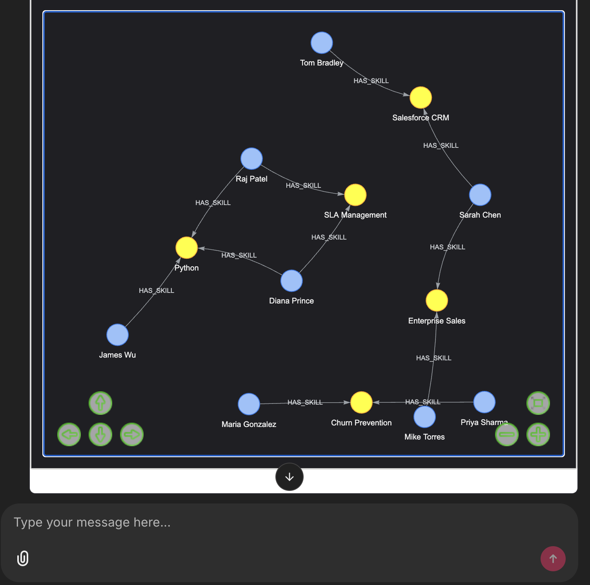

# Neo4j Graph Explorer

A Chainlit chat interface that translates natural language to Cypher with Claude, runs queries read-only against a Neo4j Aura instance, and renders the result as an interactive PyVis graph inline in the chat.



## Features

- **Natural language to Cypher** via the Anthropic API (Claude Opus 4.7 with adaptive thinking and prompt-cached schema)
- **Inline interactive graphs** via PyVis, embedded as iframes inside Chainlit messages
- **Eval-and-retry agent** (`/agent`) that runs candidate Cypher, inspects the result summary, and refines if needed, using the Anthropic SDK tool runner
- **Visual data model** (`/schema`) showing labels and relationship types both as text and as a graph
- **Read-only by design** — mutating Cypher is rejected before execution
- **Read-only Aura sessions** with a configurable node cap and query timeout

## Screenshots

### Welcome and slash commands



### `/schema` — text and data-model graph

The schema response shows the textual layout of labels, relationship types and properties...



...alongside a meta-graph rendered from `db.schema.visualization()` so you can see the data model visually:



### `/sample` — random subgraph

A summary with row counts, label distribution, and relationship-type distribution...



...followed by the interactive graph rendered directly in the message. Drag to reposition, scroll to zoom, hover for properties:


### `/agent` — eval-and-retry loop

For trickier questions, `/agent <question>` lets Claude write Cypher, run it through a `run_cypher` tool, inspect the result summary, and refine if needed. The full loop is visible:



After it converges, the final reasoning and the working Cypher are surfaced:



And the answer is rendered as a graph just like any other query:



## Architecture

```
User question
    |
    v
Chainlit chat handler  (app.py)
    |
    +--> NL to Cypher translator  (cypher_translator.py)
    |       Anthropic SDK, claude-opus-4-7, adaptive thinking,
    |       prompt-cached schema, structured JSON output
    |
    +--> Cypher agent             (cypher_agent.py)         [/agent]
    |       Anthropic tool runner: generate -> run_cypher ->
    |       inspect summary -> refine until satisfied
    |
    +--> Neo4j read-only executor (neo4j_client.py)
    |       Aura driver, READ access mode, query timeout, node cap
    |
    +--> PyVis graph renderer     (graph_renderer.py)
            Extracts nodes and relationships from result records,
            colors deterministically by label, writes interactive HTML
            served inline as a Chainlit CustomElement iframe
```

## Slash commands

| Command | What it does |
|---|---|
| Plain English question | Single-shot NL to Cypher, run, render |
| `/schema` | Show labels and relationship types as text plus the data-model graph |
| `/cypher <query>` | Run raw read-only Cypher (validated against the safety regex) |
| `/sample` | Quick `MATCH (n)-[r]->(m) RETURN n,r,m LIMIT 25` |
| `/agent <question>` | Eval-and-retry agent with iteration trace surfaced as a Step |

## Trade-offs

- **Read-only by design.** Cypher that mutates state is rejected before execution. This is defense-in-depth on top of the read-only Aura session and protects against any accidental write reaching the database through the chat UI.
- **Node cap of 200** by default. PyVis becomes sluggish past a few hundred nodes. Override with `MAX_NODES` in `.env`.
- **Schema fetched once per session** and pinned into the system prompt. Schema changes mid-session are not picked up until you start a new chat (page refresh).
- **Anthropic system prompt is cached** when the prefix exceeds the model minimum (~4K tokens for Opus 4.7), so subsequent translations are ~10x cheaper and faster after the first one.
- **`/agent` mode trades latency for robustness.** A single round trip becomes a 2-4 step loop. Use plain NL for fast questions, `/agent` for tricky ones.

## Run locally

1. Copy `.env.example` to `.env` and fill in Aura credentials and your Anthropic key.
2. Create a virtualenv and install dependencies. Python 3.12 is recommended; 3.14 is not yet supported by Chainlit's anyio version:
   ```
   python3.12 -m venv .venv
   source .venv/bin/activate
   pip install -r requirements.txt
   ```
3. Start the app:
   ```
   chainlit run app.py -w
   ```
4. Open the URL Chainlit prints (default `http://localhost:8000`).

## Deployment notes

- The `.env` file is gitignored and must never be committed. Use a secret manager in production (AWS Secrets Manager, GCP Secret Manager, Azure Key Vault).
- The Anthropic API key is workspace-scoped. Rotate via the Anthropic Console if exposed.
- Neo4j Aura credentials should rotate per the customer policy. The application uses the standard `neo4j+s://` TLS connection.
- For internet-facing deployment, add Chainlit auth via `@cl.password_auth_callback` and front the app with TLS (Caddy or ALB).

## Project layout

```
visualization/
  app.py                  Chainlit handlers
  cypher_translator.py    Anthropic single-shot NL to Cypher
  cypher_agent.py         Anthropic tool-runner agent (/agent)
  graph_renderer.py       Neo4j result to PyVis HTML
  neo4j_client.py         Driver wrapper, schema, read-only execution
  public/
    elements/GraphViz.jsx Inline iframe custom element for Chainlit
    graphs/               Generated PyVis HTML files (gitignored)
  scripts/smoke_test.py   End-to-end sanity check
  screenshots/            Repo screenshots used in this README
  prompts/initial_design.md  Original design prompt
  chainlit.md             In-app welcome page
  requirements.txt
  .env.example
```

## Prompt provenance

Per the principal architect guidance, the prompts that shaped this build are checked in under `prompts/`. They are reproducible and reviewable.
